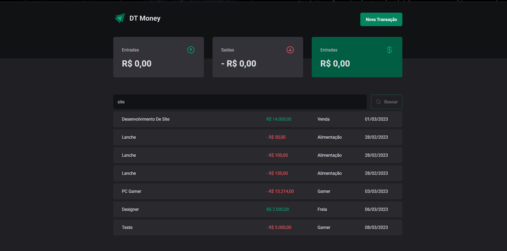
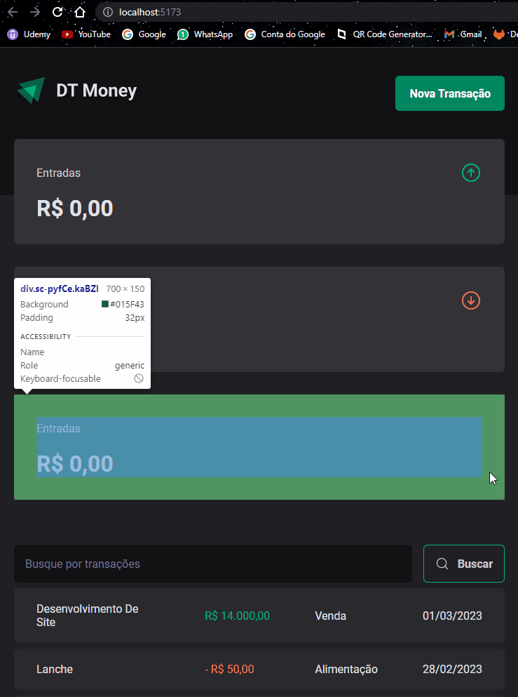

    
   

    

<h2 style="" >Tabela de Conteúdo</h2>

<ul>
   <li><a href="#tabela">Tabela de Conteúdo</a></li>
   <li><a href="#sobre">Sobre</a></li>
   <li><a href="#demonstração">Demonstração</a></li>
   <li><a href="#tecnologias">Tecnologias</a></li>
   <li><a href="#requisitos">Requisitos</a></li>
   <li><a href="#licença">Licença</a></li>
   <li><a href="#autor">Autor</a></li>
   <li><a href="#contato">Contato</a></li>
</ul>

 

------------------------------------------

# Sobre

Projeto foi desenvolvido durante o curso ignite ministrado pela <a target="_blank" href="https://www.rocketseat.com.br/">Rocketseat💜</a>, se trata de uma aplicação para cadastrar registros de entradas e saidas monetárias.

 <a target="_blank" href="#">Click Aqui para acessar a alicação</a> 

------------------------------------------

# Demonstração

Desktop

------------------------------------------

Responsive Designer

 

 

------------------------------------------

# Tecnologias

<ul>
   <li>
    <a target="_blank" href="https://vitejs.dev/">Vite</a>
     
   </li>

   <li>
    <a target="_blank" href="https://reactrouter.com/en/main/start/overview">React Router Dom</a>
    </li>
   <li>
        <a  target="_blank"href="https://www.typescriptlang.org/">TypeScript</a>
        
   </li>
   <li>
    <a target="_blank" href="https://www.npmjs.com/">Npm</a>
    </li>

<li>
    <a target="_blank" href="https://styled-components.com/">Styled Components</a>
    </li>

<li>
    <a target="_blank" href="https://reactjs.org/docs/context.html">Context Api</a>
    </li>
    
<li>
    <a target="_blank" href="https://reactjs.org/docs/hooks-reference.html#usereducer">Reduce</a>
    </li>

    
</ul>

 

------------------------------------------

# Requisitos

<ul>
   <li>Possuir Node.js versão LTS instalada</li>
   <li>Possuir NPM instalado (normalmente vem junto ao node.js)</li>
   <li>Seguir os passos abaixo</li>
   
  

      #No terminal do seu sistema
      #clone este repositório
      $ git clone <https://github.com/montanari2019/DT_money>

      # Acesse a pasta do projeto no terminal/cmd
      $ cd DT_money

      # Instale as dependências com o comando
      $ npm install

      # Execute a aplicação em modo de desenvolvimento
      $ npm run dev

      # Servidor ira executar na porta:5174 - acesse <http://localhost:5174/>

</ul>

# Licença

------------------------------------------

Distribuído sob a licença MIT. Veja <code>LICENSE</code> para mais informações.

# Autor

------------------------------------------

Ikaro Montanari, entusiasta por tecnologia e desenvolvedor front-end

Formado em Análie e Desenvolvimento de Sistemas pelo IFRO em Vilhena-RO

Desenvolvedor web nos <a target="_blank" href="https://postomirian.com.br/">Postos Mirian ⛽</a> 

# Contato

------------------------------------------

Linkedin <a target="_blank" href="https://www.linkedin.com/in/ikaro-montanari-5aa120208/">Ikaro Montanari</a> 

Instagram  <a target="_blank" href="https://www.instagram.com/ikaro_montanari/">@ikaro_montanari</a> 

Telefone <a target="_blank" href="https://api.whatsapp.com/send?phone=5569993569547&text=Ol%C3%A1%20ikaro">(69) 99356-9547</a> 

